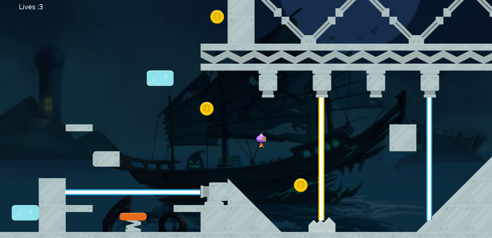

### FXGL_Mario Game
[Game Video](https://youtu.be/74vMoiGLzyk)
**This project is only used for learning JavaFX and fxgl technology;** 
**Pictures, sounds and other materials should not be used for other purposes;**  
>Pictures, sounds, etc. download from the Internet. If it infringes, please contact me to delete it;

This project is an extension of  [AlmasB Mario](https://github.com/AlmasB/FXGLGames/tree/master/Mario)  projects;
Two new levels have been added, and new levels may be added when there is time in the future; 
New Type: SPIKE, MOVE_PLATFORM,TEMP_PLATFORM,ICE_WATER,LASER,SPRINGBOARD;

**本项目仅仅用于javafx和FXGL技术的学习;** 
图片,声音等素材不要用于其他用途;
>图片,声音等来自网络,如果侵权,请联系我进行删除; 

这个项目是对 [AlmasB Mario](https://github.com/AlmasB/FXGLGames/tree/master/Mario) 的拓展; 
新增了两个关卡,未来有时间,可能会增加新的关卡;
